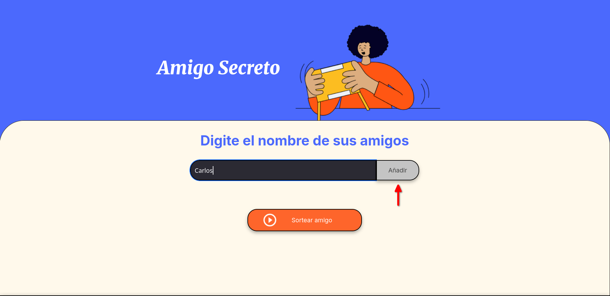

<h1 align="left">Challenge Amigo Secreto</h1>


<h2>Descripcion del proyecto</h2>
<p>Este proyecto consiste en una aplicacion web sencilla, la cual permite organizar un sorteo de amigo secreto. Los usuarios pueden agregar nombres de amigos, los cuales luego pueden ser sorteados de manera aleatoria</p>
<p>La interfaz es intuitiva y amigable, permitiendo agregar nombres mediante un campo de texto y visualizar en tiempo real la lista de participantes, una vez que todos los nombres han sido agregados, se puede realizar el sorteo con un solo click</p>

## :hammer: Funcionalidades del proyecto
- `Agregar nombres:` Los usuarios pueden escribir el nombre de un amigo dentro de un campo de texto. Al hacer clic en el botón "Añadir", el nombre se incorpora a una lista visible en pantalla.
- `Validar entrada:` Antes de agregar un nombre, el programa verifica que el campo no esté vacío y elimina los espacios en blanco. Si el usuario intenta añadir un nombre vacío, se muestra una alerta solicitando una entrada válida.
- `Visualizar la lista:` Cada nombre ingresado se muestra automáticamente en una lista debajo del campo de entrada, permitiendo al usuario ver a todos los participantes agregados.
- `Sorteo aleatorio:` Al hacer clic en el botón "Sortear Amigo", se seleccionará aleatoriamente un nombre de la lista y se mostrará en la página.

## 📁 Acceso al proyecto

Puedes acceder al código fuente del proyecto de dos formas:

- **Descargar ZIP:**  
  [Haz clic aquí](https://github.com/Angelo270204/challenge-amigo-secreto/archive/refs/heads/main.zip) para descargar el proyecto como archivo `.zip`.

- **Clonar el repositorio:**  
  Abre una terminal y ejecuta el siguiente comando:

  ```bash
  git clone https://github.com/Angelo270204/challenge-amigo-secreto.git

## 🛠️ Abre y ejecuta el proyecto

Para ejecutar el proyecto localmente, sigue estos pasos:

1. Descarga o clona el repositorio.
2. Abre la carpeta del proyecto en tu computadora.
3. Haz doble clic en el archivo `index.html` o ábrelo con tu navegador preferido.
4. ¡Listo! Ya puedes interactuar con la aplicación.

> 🌐 También puedes probar la aplicación en línea a través de GitHub Pages:  
[Ver aplicación en línea](https://angelo270204.github.io/challenge-amigo-secreto/)

## 🧭 Guía visual paso a paso

A continuación te mostramos el flujo de uso de la aplicación “Amigo Secreto” con imágenes:

---

### 🟢 Paso 1: Agrega un amigo
Escribe un nombre en el campo de texto y haz clic en el botón “Añadir”.

📌 **Botón a presionar:** `Añadir`



---

### 📋 Paso 2: Visualiza la lista de participantes
Al añadir un nombre válido, este aparecerá en una lista debajo del campo de texto.


---

### ⚠️ Paso 3: Validación de campo vacío
Si haces clic en “Añadir” sin escribir un nombre, verás una alerta.


---

### 🎲 Paso 4: Sortear un amigo
Haz clic en “Sortear amigo” para elegir aleatoriamente un participante.

📌 **Botón a presionar:** `Sortear amigo`


---

### 🚫 Paso 5: Intentar sortear sin nombres
Si haces clic en “Sortear amigo” sin haber agregado participantes, se mostrará una alerta.


## 🚀 Tecnologías utilizadas


